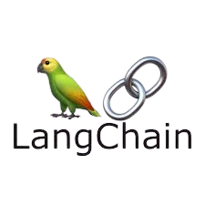

<h1 align="center">
  <picture>
    <source media="(prefers-color-scheme: dark)" srcset="aiwebscraping.png"/>
    <source media="(prefers-color-scheme: light)" srcset="aiwebscraping.png"/>
    
  
</h1>

# Web Scraping with AI

Welcome to the "Web Scraping with AI" repository! This project leverages the power of AI to perform web scraping and data extraction efficiently. Below, you'll find detailed information on how to set up, use, and contribute to this project.

## Table of Contents
- [Introduction](#introduction)
- [Features](#features)
- [Installation](#installation)
- [Usage](#usage)
- [File Structure](#file-structure)
- [Contributing](#contributing)
- [License](#license)

## Introduction
This repository provides a comprehensive solution for web scraping using AI models. It combines the capabilities of Playwright for web scraping and OpenAI's GPT-4 for data extraction and processing.

## Features
- **Asynchronous Web Scraping**: Efficiently scrape web pages using Playwright.
- **AI-Powered Data Extraction**: Use OpenAI's GPT-4 to extract and process data.
- **Schema-Based Extraction**: Define extraction schemas using Pydantic for structured data output.
- **HTML Sanitization**: Clean and sanitize HTML content to remove unwanted tags.

## Installation
To get started, clone the repository and install the required dependencies:
